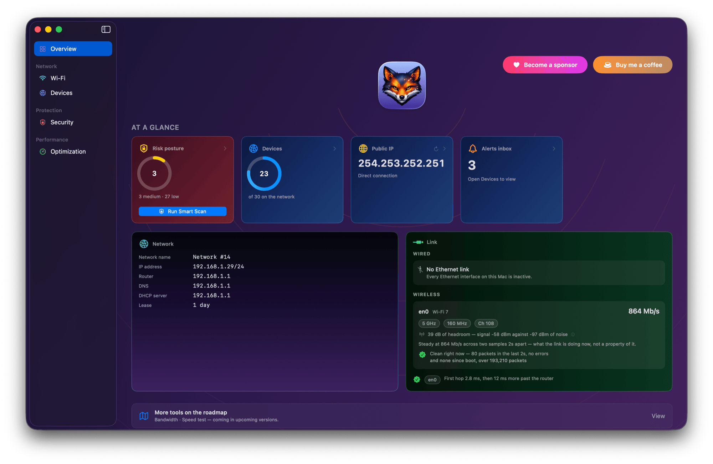

<p align="center">
  
</p>

<h1 align="center">Netfox</h1>

<p align="center">
  <strong>A native macOS network monitor — devices, history, alerts.</strong><br/>
  Every connected device, every Wi-Fi neighbour, every risk worth knowing about, at a glance.
</p>

<p align="center">
  <a href="https://github.com/gfazioli/netfox-website/releases/latest"></a>
  <a href="https://www.apple.com/macos/"></a>
  <a href="LICENSE"></a>
</p>

<p align="center">
  <a href="https://netfox.app">Website</a>
  ·
  <a href="https://netfox.app/docs/getting-started">Documentation</a>
  ·
  <a href="https://github.com/gfazioli/netfox-website/releases/latest">Download</a>
</p>

<p align="center">
  
</p>

## What is Netfox?

Netfox is a native macOS app that gives you a live, honest view of who's on your network. Instead of a vendor router app or a stale ARP table, you get five focused tools sharing the same store — a finding in one shows up everywhere it matters.

- **Live device list** — every machine on your network, with hostname, MAC, IPv4/IPv6, vendor, and online state
- **Multi-source discovery** — Bonjour/mDNS, the system ARP cache, SSDP, NetBIOS, and active ICMP probing run in parallel. Apple devices, smart-TVs, dumb IoT, quiet hosts — all in the same list
- **Per-device history** — first seen, last seen, every transition (online ↔ offline, IPv4 learned/changed, hostname changed, vendor learned) on a timeline that survives across launches
- **Security checks** — one-click *Scan All Devices* probes every reachable host against a curated home-network port set (SSH, Telnet, RDP, VNC, SMB, HTTP, MQTT, MySQL/PostgreSQL/Redis, …) and shows risk badges per device. The Risk Inspector explains each finding in plain English
- **Wi-Fi diagnostics** — every wireless network your Mac can see, with live signal-strength history, channel, band, and security mode. Cross-link to "devices on this network" when the selected row is the AP you're connected to
- **Five-kind alerts** — new device, returning after long absence, risky arrival, port-state change, new service. In-app inbox plus native macOS notifications, with a persistent log of everything that ever fired
- **Public IP + VPN awareness** — shows your network's outward face on the Overview, with a live chip when the connection is being tunnelled
- **Tagging** — right-click any device to give it a custom name and icon. Useful for the cryptic vendor-name rows ("Espressif Inc.") that mean nothing without context
- **Demo Mode** — one-keystroke (⌘⇧D) privacy mask for screenshots and screen-shares: device names collapse to `Computer #1`, MACs lose the last three octets, IPv6 loses everything past the first hextet, Wi-Fi SSIDs become `Network #N`
- **Native macOS UI** — SwiftUI throughout, modern look, follows system appearance
- **No account, no cloud, no telemetry** — every observation lives on your Mac
- **Universal binary** — runs on Apple Silicon and Intel Macs
- **Auto-updates** — built in, signed

## Download

[**→ Download the latest version**](https://github.com/gfazioli/netfox-website/releases/latest)

After downloading, open the DMG and drag Netfox into your Applications folder. Launch it normally — the app is signed with Apple Developer ID and notarized by Apple, so Gatekeeper accepts it on first open.

## Requirements

- macOS 15 (Sequoia) or later
- A local network — Wi-Fi, Ethernet, or anything macOS reports as an interface with a subnet
- The Wi-Fi tool requires Location permission (macOS gates SSID details there). Netfox asks once the first time you open it; data never leaves your Mac.

## Documentation

Full documentation, screenshots, FAQ and roadmap at **[netfox.app](https://netfox.app)**.

## About this repository

This repo hosts the **marketing site** and **release downloads** for Netfox. The app source lives in a separate repository.

The site is built with [Next.js 16](https://nextjs.org/), [Mantine 9](https://mantine.dev/) and [Nextra 4](https://nextra.site/).

### Local development

```bash
yarn install
yarn dev
```

Then visit [http://localhost:3000](http://localhost:3000).

## License

MIT
